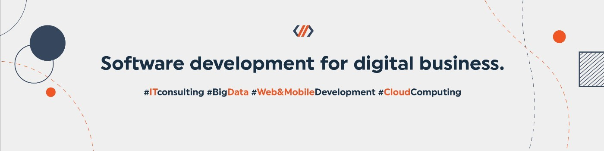

<p style="text-align: center;"></p>

# Codete RxJS Quick Start

This repository is a part of tutorial https://codete.com/blog/rx-js-quick-introduction-with-examples-for-beginner-level-angular-developers

<p style="text-align: center;"></p>

## Minimal node version:
- Windows & MacOS: v14
- Linux: v12

## How to use this project:

1. Install nx cli from https://nx.dev

2. To start backend server:
```
nx serve api
```

3. To start frontend client:
```
nx serve codete
```
4. Go to http://localhost:4200

