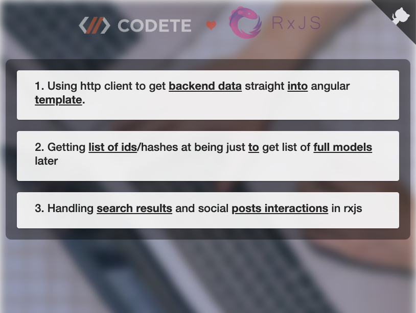
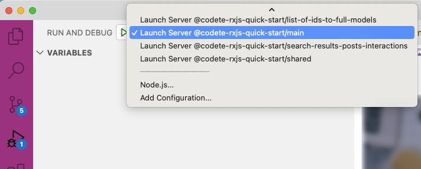

# Codete RxJS Quick Start

<p style="text-align: center;"></p>

<p style="text-align: center;"></p>

# Installation & build

1. Install firedev:
```
npm i -g firedev
```

2. Clone project:
```
git clone https://github.com/codete/codete-rxjs-quick-start.git
```

3. Open it in Visual Studio Code:
```
code codete-rxjs-quick-start
```

4. Start build (no need to npm install)
```
firedev start
```

5. Start server ( if your see console message : *open your browser on http://localhost:4200* ):

Select proper debug task and press F5 on keyboard




6. Open browser: http://localhost:4200


# QA

- **How to start application on different port ?**

*firedev start --port 3333*


- **How to start server on different port ?**

*modify host variable in ./shared/src/lib/constants.ts*


- **How to start server wihout Visual Studio Code ?**

*npx ts-node run.js*


- **Can I use different editor than Visual Studio Code ?**

*sure .. but remember that firedev cli generates configs for VSCode (hidden files, server launch etc.)*


